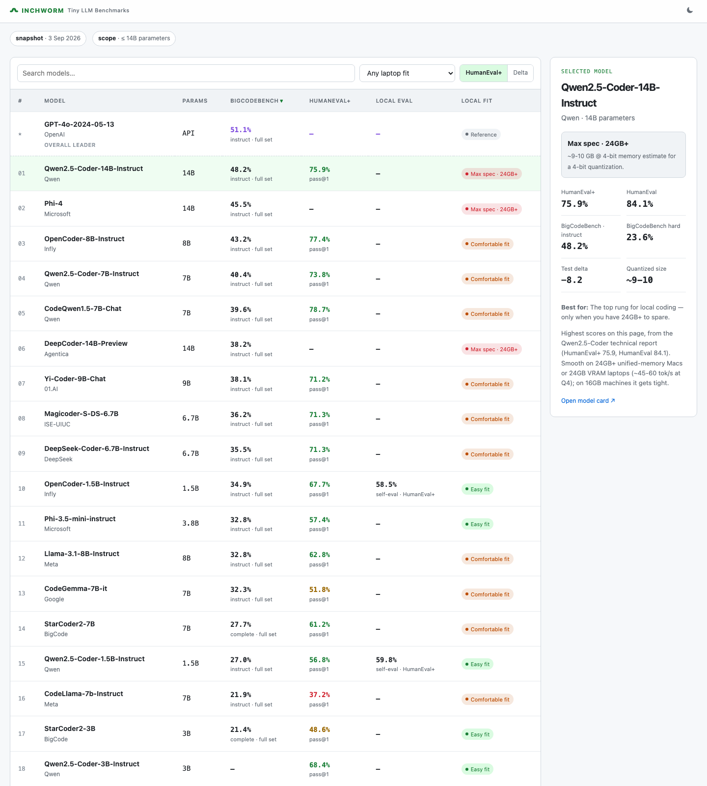

# INCHWORM — Tiny LLM Benchmarks

A laptop-level leaderboard for open coding models at **≤14B parameters**.

> A sortable, filterable leaderboard comparing open coding LLMs you can actually run on a laptop. Every score is a pass@1 percentage compiled from public sources — EvalPlus, BigCodeBench, and official model cards — and embedded in the page as a local snapshot.



## Features

- **BigCodeBench** — the primary lens (Full-set pass@1, instruct lens; `complete` for base models).
- **HumanEval+** / **Delta** — toggleable HumanEval+ view and its delta vs. plain HumanEval.
- **Local eval** — HumanEval+ measured from our own self-evaluated runs on this machine, a directional check on vendor numbers.
- **Local fit** — `easy` / `mid` / `heavy` / `max spec (14B, 24GB+)` tiers plus quantized memory estimates.
- **Freshness badges** — clearly separates the current model catalog from historical HumanEval+ and BigCodeBench score snapshots.
- **Pending Eval tab** — newly released small models can be listed without inventing scores, while community members are invited to run and submit comparable HumanEval+ results.
- **Dark/light themes**, live search, and per-column sorting — all in vanilla JS.

## Sources & methodology

The model catalog is checked separately from benchmark freshness. HumanEval+ is a historical snapshot, and BigCodeBench results are frozen around April 2025; newer models may appear in the **Pending Eval** tab, where card-reported LiveCodeBench pass@1 is shown as a directional reference and comparable-harness scores stay blank until a result is available. The HF Open SLM leaderboard can help discover candidates, but its scores are not copied into the coding table because its tasks, harness, prompts, and evaluation conditions are different. Community submissions should use the official EvalPlus evaluator and include enough runtime, hardware, precision, model revision, and prompt details to be useful.

The roster lives in `models.json`; the page's data layer is regenerated from it with `python3 scripts/build_page.py`, so the shipped `index.html` stays a single self-contained file.

## Why these benchmarks?

The big leaderboards moved to agentic, human-preference, and anti-contamination suites because static single-turn sets like HumanEval got saturated and contaminated at frontier scale. But small ≤14B laptop models haven't saturated HumanEval+/BigCodeBench, single-turn completion is how you actually use a 7B on a laptop, and agentic harnesses aren't practical there. So this page sticks with measured pass@1 on the classic code benchmarks — the right lens for the laptop models it tracks.

## Add your local benchmark

Ran a model yourself? Submit your HumanEval+ result for the **Local eval** column. Append one entry to `entries` in `user_benchmarks.json` and open a PR — CI validates the schema and that your GitHub username is on the entry.

```json
{
  "model": "OpenCoder-1.5B-Instruct",
  "hf_id": "infly/OpenCoder-1.5B-Instruct",
  "user": "your-gh-username",
  "date": "2026-09-03",
  "hardware": "M2 Pro 32GB (MPS)",
  "precision": "bf16",
  "runtime": "transformers",
  "humaneval_plus": 58.5,
  "humaneval": 59.8,
  "notes": "plain chatml, greedy; official EvalPlus evaluator"
}
```

`model` must match the name exactly as it appears on the leaderboard, and `humaneval_plus` (0–100) must come from the official EvalPlus evaluator or an equivalent harness. Re-runs by the same user replace their earlier entry. Once a model has entries from ≥3 distinct users, maintainers promote the median into the `local` field on the page.

## Pending local benchmarks

We're running the current **8B-class batch** of HumanEval+ self-evals locally (plain chatml, greedy, official EvalPlus evaluator). Scores land in the **Local eval** column as each run finishes.

| Status | Model | HumanEval+ (local) |
| --- | --- | --- |
| ✔ Done | OpenCoder-1.5B-Instruct | 58.5 |
| ✔ Done | Qwen2.5-Coder-1.5B-Instruct | 59.8 |
| ✔ Done | Qwen3-8B | 81.1 |
| ⏳ Queued | Cogito-v1-preview-llama-8B | — |
| ⏳ Queued | Granite-3.3-8B-Instruct | — |
| ⏳ Queued | Ministral-8B-Instruct-2410 | — |
| ⏳ Queued | DeepSeek-R1-Distill-Llama-8B | — |

<!-- Each model takes ~35–45 min on an M2 Pro (MPS). -->